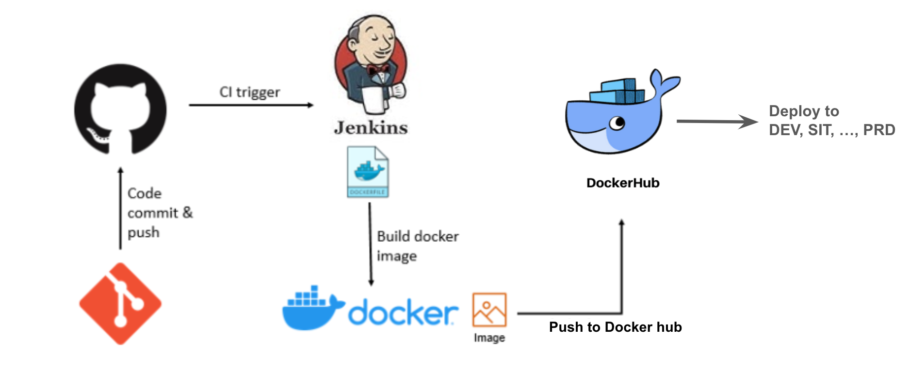

# My jenkins sample



## Install jenkins with Dockerfile

Build docker image name: `jenkins-dind`

```
docker build -t jenkins-dind .
```

Run container
```
docker run -p 8080:8080 -p 50000:50000 -d -v ~/jenkins_home:/var/jenkins_home  -v /var/run/docker.sock:/var/run/docker.sock jenkins-dind
```

Go to `http://localhost:8080`

Copy your container id by `docker ps`

Get your password by replace `<CONTAINER_ID>` with output form `docker ps`

```
docker exec <CONTAINER_ID> cat /var/jenkins_home/secrets/initialAdminPassword
```

Choosing install suggested plugin and waiting

Filling username, password, full name and email 

Setting Jenkins URL: `http://localhost:8080/` (by default)

## Add docker hub credential
Go to `http://localhost:8080/manage/credentials/store/system/domain/_/`

Click `Add credential` button

- Kind: Username with password
- Scope: Global
- Username: `YOUR_DOCKER_HUB_USER`
- Password: `YOUR_DOCKER_HUB_PASSWORD`
- ID: docker_hub
- Description: docker hub

## Create & Setup pipelines

### CI Pipeline

On first page click `+ New Item` menu

Enter pipeline name

Click Pipeline option and submit 

then input code to pipeline script

> replace xxxxx with your docker hub account

```
pipeline {
    agent any

    stages {
        stage('Checkout code') {
            steps {
              git branch: 'main', url: 'https://github.com/srankmeng/my-jenkins-sample.git'
            }
        }
        stage('Code analysis') {
            steps {
                echo 'Code analysis'
            }
        }
        stage('Unit test') {
            steps {
                echo 'Unit test'
            }
        }
        stage('Code coverage') {
            steps {
                echo 'Code coverage'
            }
        }
        stage('Build images') {
            steps {
                sh 'docker build -f ./json-server/Dockerfile -t xxxxx/json-server:0.1.0 ./json-server'
            }
        }
        stage('Setup & Provisioning') {
            steps {
                sh 'docker run -p 3000:3000 --name json-server -d xxxxx/json-server:0.1.0'
            }
        }
        stage('Run api automate test') {
            steps {
                sh 'docker build -f ./newman/Dockerfile -t xxxxx/newman:0.1.0 ./newman'
                sh '''
                    docker run --add-host=host.docker.internal:host-gateway xxxxx/newman:0.1.0 \
                    run demo.postman_collection.json -e environment.postman_environment.json \
                    -r cli,htmlextra --reporter-htmlextra-export reports/report.html \
                    --env-var "HOST=host.docker.internal:3000"
                '''
            }
        }
    }
    post {
        always {
            sh 'docker rm -f json-server || true'
        }
    }
}

```


### Push to registry after CI success

Add 'Push Docker Image to Docker Hub' stage after `stage('Run api automate test')`

>replace `xxxxx` with your docker hub account

```
stage('Push Docker Image to Docker Hub') {
    steps {
        withCredentials([usernamePassword(credentialsId: 'docker_hub'
        , passwordVariable: 'DOCKER_PASS', usernameVariable: 'DOCKER_USER')]) {
            sh 'docker login -u $DOCKER_USER -p $DOCKER_PASS'
            sh '''docker image tag xxxxx/json-server:0.1.0 xxxxx/json-server:$BUILD_NUMBER
                    docker image push xxxxx/json-server:$BUILD_NUMBER'''
        }        
    }
}
```

Go to docker hub to check images

### Add deployment

Add 'Deploy application' stage after `stage('Push Docker Image to Docker Hub')`

>replace `xxxxx` with your docker hub account

```
stage('Deploy application') {
    steps {
        sh 'docker rm -f json-server-dev || true'
        sh 'docker run -p 3001:3000 --name json-server-dev -d xxxxx/json-server:$BUILD_NUMBER'       
    }
}
```
Go to `http://localhost:3001/`

### Separate CD from CI pipelines
Create the new pipeline name: `demo_deploy_pipeline` then input code to pipeline script
>replace `xxxxx` with your docker hub account
```
pipeline {
    agent any
    parameters {
        string(name: 'IMAGE_TAG', defaultValue: '', description: 'docker image tag version')
    }

    stages {
        stage('Deploy application') {
            steps {
                sh 'docker rm -f json-server-dev || true'
                sh 'docker run -p 3001:3000 --name json-server-dev -d xxxxx/json-server:${IMAGE_TAG}'       
            }
        }
    }
    post {
        always {
            echo 'deploy done'
        }
    }
}
```

Back to the first pipeline:

- Remove `stage('Deploy application')` block

- Update script in `post` block
```
    post {
        always {
            sh 'docker rm -f json-server || true'
        }
        success {
            script {
                def currentBuildNumber = env.BUILD_NUMBER
                build job: 'demo_deploy_pipeline', parameters: [string(name: 'IMAGE_TAG', value: "${currentBuildNumber}")]
            }
        }
    }
```

### Polling git for trigger pipelines
Go to the first pipeline: Configure > Build Triggers > Poll SCM > input `* * * * *`


## Blue Ocean

Manage Jenkins > Plugins > Available plugins > search `blue ocean` > checked and install


